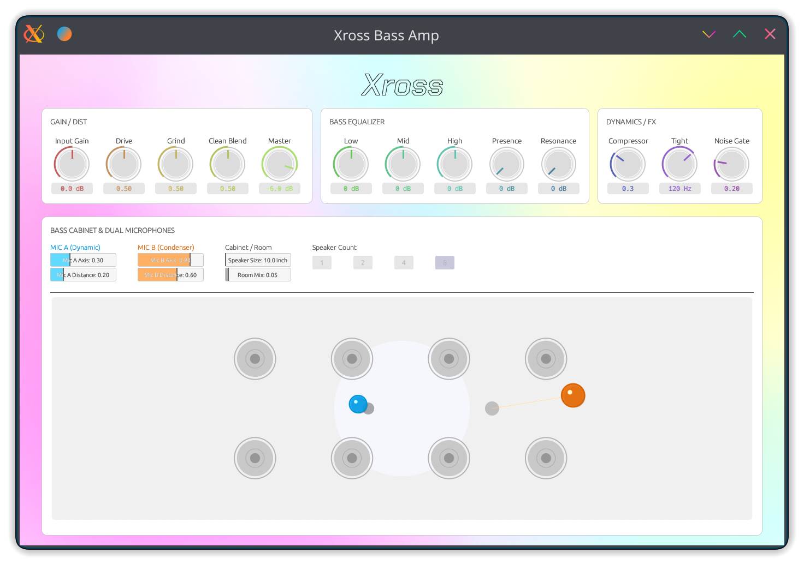

# Xross Bass Amp



Xross Bass Amp is a modern, high-gain bass amplifier plugin built with Rust and the [nih-plug](https://github.com/robbert-vdh/nih-plug) framework. Designed for the modern bassist, it focuses on maintaining low-end clarity while delivering aggressive, harmonically rich distortion through a sophisticated parallel processing engine.

## Features

### 🎸 Parallel Gain Section
* **Crossover Drive:** Splits the signal at 250Hz. The low-end remains clean and punchy, while only the high-end is sent to the drive section to ensure your bass never loses its "core."
* **Grind & Tight:** Features a dedicated "Grind" control for pre-distortion mid-high emphasis and a "Tight" high-pass filter to eliminate low-end flabbiness, perfect for down-tuned or multi-string basses.
* **Asymmetric Saturation:** A multi-stage saturation engine using `atan` and `tanh` functions to emulate organic tube warmth combined with modern solid-state grit.

### 🎛️ Dynamic Control & FX
* **Built-in Compressor:** Optimized for bass frequencies to even out dynamics and increase sustain before the signal hits the drive stage.
* **Smart Noise Gate:** A responsive gate designed to kill hum and hiss during high-gain playing without cutting off natural note decays.
* **Master Blend:** Precisely mix the clean low-end with the processed dirty path for the ultimate "clank" or subtle grit.

### 🔊 Physical Cabinet Modeling
* **Speaker Customization:** Select speaker sizes (10" to 15") and classic bass configurations like 1x15, 4x10, or the legendary 8x10 "fridge."
* **Dual Microphone Setup:** Two independent virtual microphones (Mic A & Mic B) with adjustable **Axis** and **Distance** for realistic air movement.
* **Post-Drive Filtering:** Integrated 8kHz low-pass filter to smooth out "fizz" and provide a polished, record-ready high-end.

### ✨ Technical Excellence
* **Stable Filters:** All filtering is handled by Topology Preserving Transform (TPT) structures for analog-like behavior and stability at high frequencies.
* **Zero-Latency Design:** Optimized for real-time performance and tracking.

### 🎨 Modern User Interface
* **Vibrant GUI:** Built with `egui`, featuring smooth animations and a responsive, high-frame-rate layout.
* **Interactive Visualizer:** A 2D top-down view for intuitive microphone positioning.
* **High Precision:** All parameters support double-click to reset and direct text input for surgical adjustments.

## Plugin Formats
* **CLAP**
* **VST3**
* **Standalone**

## Building from Source

Ensure you have [Rust](https://rustup.rs/) and [Cargo](https://doc.rust-lang.org/cargo/) installed.

```bash
# Clone the repository
git clone https://github.com/The-Infinitys/xross-bass-amp.git
cd xross-bass-amp

# Build the plugin (Standalone / VST3 / CLAP)
cargo bundle --release
```

The resulting binaries will be located in `target/bundled/`.

## Credits
Developed by **The Infinitys**.

* Email: [the.infinity.s.infinity@gmail.com](mailto:the.infinity.s.infinity@gmail.com)
* GitHub: [https://github.com/The-Infinitys/xross-bass-amp](https://github.com/The-Infinitys/xross-bass-amp)
